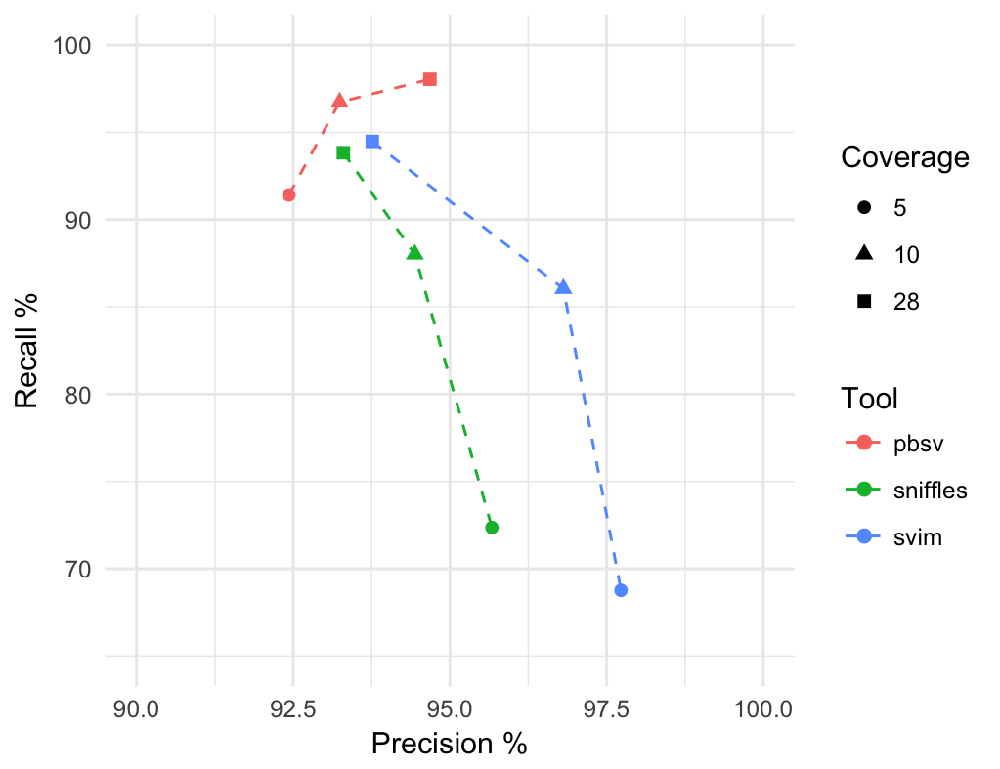

# Structural Variant Calling Benchmark

This benchmark is based on the publicly available PacBio CCS 15kb dataset of
the Ashkenazim son HG002/NA24385. We provide each step how to reproduce the
final metrics with publicly available tools.

Please let us know, if you find mistakes or want your tool added.

# Comparison

At 28-fold coverage:

|Run|F1^ %|Precision %|Recall %|FP|FN|FP+FN|
|:-:|:-:|:-:|:-:|:-:|:-:|:-:|
|[**pbsv**](https://github.com/PacificBiosciences/pbsv)|96.29|94.61|98.02|538|191|729|
|[**svim**](https://github.com/eldariont/svim)|94.12|93.76|94.48|606|532|1138|
|[**sniffles**](https://github.com/fritzsedlazeck/Sniffles)|93.56|93.30|93.83|650|595|1245|

Coverage titration for 5, 10, and 28-fold:




# Get tools

Information how to install `conda` and add the `bioconda` channel is available
on https://bioconda.github.io/.

```sh
conda create --name sv python=3.6
source activate sv
conda install pbmm2==0.12.0 pbsv==2.2 svim==0.4.3 sniffles==1.0.10
```

# Get data
1) Create directory structure:
```sh
mkdir -p fastqs ref alns alns_merged tools/{pbsv,sniffles} giab
```

2) Download genome in a bottle annotations:
```sh
FTPDIR=ftp://ftp-trace.ncbi.nlm.nih.gov/giab/ftp/data/AshkenazimTrio/analysis/
curl -s ${FTPDIR}/NIST_SVs_Integration_v0.6/HG002_SVs_Tier1_v0.6.bed > giab/HG002_SVs_Tier1_v0.6.bed
curl -s ${FTPDIR}/NIST_SVs_Integration_v0.6/HG002_SVs_Tier1_v0.6.vcf.gz > giab/HG002_SVs_Tier1_v0.6.vcf.gz
```

3) Make sure that you have exact truvari version (check that all python dependencies are met, not described):
```sh
git clone https://github.com/spiralgenetics/truvari
(cd truvari; git reset --hard 600b4ed7)
```

4) Download hg19 reference with decoys and map non-ACGT characters to N:
```sh
curl -s ftp://ftp-trace.ncbi.nih.gov/1000genomes/ftp/technical/reference/phase2_reference_assembly_sequence/hs37d5.fa.gz > ref/human_hs37d5.fasta.gz
gunzip ref/human_hs37d5.fasta.gz
sed -i '/^[^>]/ y/BDEFHIJKLMNOPQRSUVWXYZbdefhijklmnopqrsuvwxyz/NNNNNNNNNNNNNNNNNNNNNNNNNNNNNNNNNNNNNNNNNNNN/' ref/human_hs37d5.fasta
```

5) Download hg19 tandem repeat annotations:
```sh
curl -s https://raw.githubusercontent.com/PacificBiosciences/pbsv/master/annotations/human_hs37d5.trf.bed > ref/human_hs37d5.trf.bed
```

6) Download all `.fastq` files:
```sh
FTPDIR=ftp://ftp-trace.ncbi.nlm.nih.gov/giab/ftp/data/AshkenazimTrio/HG002_NA24385_son/PacBio_CCS_15kb/
for fastq in $(curl -s -l ${FTPDIR} | grep -E '.fastq$'); do curl -s ${FTPDIR}${fastq} > fastqs/${fastq}; done
```

# Alignment

6) Index reference:
```sh
pbmm2 index ref/human_hs37d5.fasta ref/human_hs37d5.mmi --preset CCS
```

7) Align each movie, can be done in parallel:
```sh
for i in fastqs/*.fastq; do
    FILENAME="${i#*fastqs/}"
    FILEPREFIX="${FILENAME%.*}"
    pbmm2 align ref/human_hs37d5.mmi $i "alns/hg19.${FILEPREFIX}.bam" --preset CCS \
                --sort --rg '@RG\tID:${FILEPREFIX}' --sample HG2
done
```

# Run pbsv

8a) Discover SV signatures for each alignment, can be done in parallel:
```sh
for i in alns/*.bam; do
    FILENAME="${i#*alns/}"
    FILEPREFIX="${FILENAME%.*}"
    pbsv discover $i "tools/pbsv/${FILEPREFIX}.svsig.gz" --tandem-repeats ref/human_hs37d5.trf.bed
done
```

8b) Call and polish SVs:
```sh
pbsv call ref/human_hs37d5.fasta tools/pbsv/*.svsig.gz tools/pbsv/hg2.pbsv.vcf --ccs -t INS,DEL
bgzip tools/pbsv/hg2.pbsv.vcf
tabix tools/pbsv/hg2.pbsv.vcf.gz
```

# Run svim

9a) Merge and re-sort alignments:
```sh
samtools merge -b alns_merged/bam_list.fn alns_merged/hs37d5.all.bam
samtools sort -n alns_merged/hs37d5.all.bam > alns_merged/hs37d5.all.querysorted.bam
```

9b) Run svim:
```sh
svim alignment --cluster_max_distance 1.4 tools/svim alns_merged/hs37d5.all.querysorted.bam
```

9c) Prepare for truvari:
```sh
cat tools/svim/final_results.vcf \
    | sed 's/INS:NOVEL/INS/g' \
    | sed 's/DUP:INT/INS/g' \
    | sed 's/DUP:TANDEM/INS/g' \
    | awk '{ if($1 ~ /^#/) { print $0 } else { if(($5=="<DEL>" || $5=="<INS>") && $6>40) { print $0 } } }' \
    > tools/svim/hg2.svim.vcf
bgzip tools/svim/hg2.svim.vcf
tabix tools/svim/hg2.svim.vcf.gz
```

# Run sniffles

10a) Add MD tag to BAM:
```sh
samtools calmd -bS alns_merged/hs37d5.all.bam ref/human_hs37d5.fasta > alns_merged/hs37d5.all.md.bam
```

10b) Run sniffles:
```sh
sniffles -s 3 --skip_parameter_estimation -m alns_merged/hs37d5.all.md.bam -v tools/sniffles/hg2.sniffles.vcf --report_seq
```
10c) Prepare for truvari:
```sh
cat <(cat tools/sniffles/hg2.sniffles.vcf | grep "^#") \
    <(cat tools/sniffles/hg2.sniffles.vcf | grep -vE "^#" | \
      grep 'DUP\|INS\|DEL' | sed 's/DUP/INS/g' | sort -k1,1 -k2,2g) \
    | bgzip -c > tools/sniffles/hg2.sniffles.vcf.gz
tabix tools/sniffles/hg2.sniffles.vcf.gz
```

# Final comparison

11) Compare to ground truth:
```sh
truvari/truvari.py -f ref/human_hs37d5.fasta -b giab/HG002_SVs_Tier1_v0.6.vcf.gz\
                   --includebed giab/HG002_SVs_Tier1_v0.6.bed -o bench-pbsv --passonly\
                   --giabreport -r 1000 -p 0.00 -c tools/pbsv/hg2.pbsv.vcf.gz
truvari/truvari.py -f ref/human_hs37d5.fasta -b giab/HG002_SVs_Tier1_v0.6.vcf.gz\
                   --includebed giab/HG002_SVs_Tier1_v0.6.bed -o bench-svim --passonly\
                   --giabreport -r 1000 -p 0.00 -c tools/svim/hg2.svim.vcf.gz
truvari/truvari.py -f ref/human_hs37d5.fasta -b giab/HG002_SVs_Tier1_v0.6.vcf.gz\
                   --includebed giab/HG002_SVs_Tier1_v0.6.bed -o bench-sniffles --passonly\
                   --giabreport -r 1000 -p 0.00 -c tools/sniffles/hg2.sniffles.vcf.gz
```

12) Parse results:
```sh
function sumsv() { cat $1 | grep ':' | tr -d ',' |sed "s/^[ \t]*//"| tr -d '"' |\
                   tr -d ' ' | tr ':' '\t' | awk '{ for (i=1; i<=NF; i++)  {
                     a[NR,i] = $i } } NF>p { p = NF } END { for(j=1; j<=p; j++)
                     { str=a[1,j]; for(i=2; i<=NR; i++){ str=str" "a[i,j]; } print str } }' |\
                   tail -n 1 | awk '{ printf "%1.4f\t%1.4f\t%1.4f\t%10.0f\t%10.0f\t%10.0f\n", $2,$4,$11,$1,$8,$1+$8 }';}
cat <(echo -e "Run\tF1\tPrecision\tRecall\tFP\tFN\tFP+FN")\
    <(cat <(for i in bench*; do printf $i"\t";sumsv $i/summary.txt;done) |\
    sed 's/bench//g;s/-//g' | sort -k 2 -n -r) | column -t
```
Or for markdown:
```sh
cat <(echo -e "Run\tF1\tPrecision\tRecall\tFP\tFN\tFP+FN")\
    <(echo -e ":-:\t:-:\t:-:\t:-:\t:-:\t:-:\t:-:")\
    <(cat <(for i in bench*; do printf $i"\t";sumsv $i/summary.txt;done) |\
    sed 's/bench//g;s/-//g' | sort -k 2 -n -r) | tr '\t' ' ' | tr -s ' ' | tr ' ' '|' | awk '{print "|"$0"|"}'
```

# Coverage titrations
13) Create a new base folder for each coverage and subsample the merged BAM with MD:
```sh
samtools view -bS -s 0.35 alns_merged/hs37d5.all.md.bam > ../10x/alns_merged/hs37d5.all.md.bam
samtools view -bS -s 0.18 alns_merged/hs37d5.all.md.bam > ../5x/alns_merged/hs37d5.all.md.bam
```
Repeat steps to run pbsv, sniffles, and svim.
For pbsv, run `discover` only once for this merged BAM.

# Plot

14) Extract TP information:
```sh
 cat bench-pbsv/tp-base.vcf| grep -v '#' | awk '{ split($8,a,";"); for(i in a) { split(a[i],b,"="); if (b[1] == "SVLEN" || b[1] == "PctSizeSimilarity" || b[1] == "SizeDiff") printf(b[2] "\t");  } print "pbsv" }' > pbsv.tpbase
 cat bench-svim/tp-base.vcf| grep -v '#' | awk '{ split($8,a,";"); for(i in a) { split(a[i],b,"="); if (b[1] == "SVLEN" || b[1] == "PctSizeSimilarity" || b[1] == "SizeDiff") printf(b[2] "\t");  } print "svim" }' > svim.tpbase
 cat bench-sniffles/tp-base.vcf| grep -v '#' | awk '{ split($8,a,";"); for(i in a) { split(a[i],b,"="); if (b[1] == "SVLEN" || b[1] == "PctSizeSimilarity" || b[1] == "SizeDiff") printf(b[2] "\t");  } print "sniffles" }' > sniffles.tpbase
```

15) Run truvari, computing sequence similarity (unsupported by svim):
```sh
truvari/truvari.py -f ref/human_hs37d5.fasta -b giab/HG002_SVs_Tier1_v0.6.vcf.gz\
                   --includebed giab/HG002_SVs_Tier1_v0.6.bed -o bench-seq-pbsv --passonly\
                   --giabreport -r 1000 -p 0.01 -c tools/pbsv/hg2.pbsv.vcf.gz
truvari/truvari.py -f ref/human_hs37d5.fasta -b giab/HG002_SVs_Tier1_v0.6.vcf.gz\
                   --includebed giab/HG002_SVs_Tier1_v0.6.bed -o bench-seq-sniffles --passonly\
                   --giabreport -r 1000 -p 0.01 -c tools/sniffles/hg2.sniffles.vcf.gz
```

Extract seq info
```sh
 cat bench-pbsv/tp-base.vcf | grep -v '#' | awk '{ split($8,a,";"); for(i in a) { split(a[i],b,"="); if (b[1] == "SVLEN" || b[1] == "PctSeqSimilarity") printf(b[2] "\t");  } print "pbsv" }' > pbsv.tpbaseseq
 cat bench-sniffles/tp-base.vcf | grep -v '#' | awk '{ split($8,a,";"); for(i in a) { split(a[i],b,"="); if (b[1] == "SVLEN" || b[1] == "PctSeqSimilarity") printf(b[2] "\t");  } print "sniffles" }' > sniffles.tpbaseseq
```

16a) Compute perfect SV size matches:
```R
tp1 = fread("~/pbsv.tpbase")
tp2 = fread("~/svim.tpbase")
tp3 = fread("~/sniffles.tpbase")
tp = bind_rows(tp1,tp2,tp3)
names(tp) = c("length", "pct", "diff", "tool")
tp = tp %>% mutate(type=ifelse(length<0,"DEL","INS"))
tp$length = abs(tp$length)

tp %>% mutate(bin=abs(diff)) %>% group_by(tool,bin) %>% summarize(count=n()) %>% filter(bin == 0) %>% group_by(tool) %>% summarize(sum(count)/9641)
```

16b) Plot TP by bins
```R
x = bind_rows(tp %>% filter(type=="INS") %>% filter(length<1000) %>% mutate(bin=ceiling(abs(length)/100)*100) %>% group_by(tool,bin,type) %>% summarize(count=n()),
              tp %>% filter(type=="DEL") %>% filter(length<1000) %>% mutate(bin=ceiling(abs(length)/100)*100) %>% group_by(tool,bin) %>% summarize(count=n()) %>% mutate(bin=-1*bin))

m=1.5
gs=ggplot() +
  geom_rect(data=x%>%filter(tool=="pbsv"), aes(xmin=bin-30*m,xmax=bin-10*m,ymin=10,ymax=count,fill=tool))+
  geom_rect(data=x%>%filter(tool=="svim"), aes(xmin=bin-10*m,xmax=bin+10*m,ymin=10,ymax=count,fill=tool))+
  geom_rect(data=x%>%filter(tool=="sniffles"), aes(xmin=bin+10*m,xmax=bin+30*m,ymin=10,ymax=count,fill=tool))+
  scale_x_continuous(breaks=seq(-1000,1000,200),limits=c(-1050,1050))+
  ylab("Counts")+
  theme_minimal()

y = bind_rows(tp %>% filter(type=="INS") %>% filter(length<10000 & length>=1000) %>% mutate(bin=round(abs(length)/1000)*1000) %>% group_by(tool,bin) %>% summarize(count=n()),
              tp %>% filter(type=="DEL") %>% filter(length<10000 & length>=1000) %>% mutate(bin=round(abs(length)/1000)*1000) %>% group_by(tool,bin) %>% summarize(count=n()) %>% mutate(bin=-1*bin))
gl=ggplot() +
  geom_rect(data=y%>%filter(tool=="pbsv"), aes(xmin=bin-300*n,xmax=bin-100*n,ymin=0,ymax=count,fill=tool))+
  geom_rect(data=y%>%filter(tool=="svim"), aes(xmin=bin-100*n,xmax=bin+100*n,ymin=0,ymax=count,fill=tool))+
  geom_rect(data=y%>%filter(tool=="sniffles"), aes(xmin=bin+100*n,xmax=bin+300*n,ymin=0,ymax=count,fill=tool))+
  scale_x_continuous(breaks=seq(-20000,20000,2000),limits=c(-10500,10500))+
  xlab("True SV size")+
  ylab("Counts")+
  theme_minimal()


g = ggarrange(gs,gl,ncol=1,
          nrow = 2,
          common.legend = TRUE,
          legend="bottom",labels=c("A","B"), align='hv'
)

ggsave("tp.pdf",g,width=20,height=10,dpi=200,units="cm")
```

16c) Plot sequence similarity for insertions
```R
tpseq1 = fread("~/pbsv.tpbaseseq")
tpseq3 = fread("~/sniffles.tpbaseseq")
tpseq = bind_rows(tpseq1,tpseq3)
names(tpseq) = c("length", "seqpct", "tool")
tpseq = tpseq %>% mutate(type=ifelse(length<0,"DEL","INS"))
tpseq$length = abs(tpseq$length)

x = tpseq %>% group_by(tool, type, seqpct) %>% summarize(count=n()) %>% arrange(desc(seqpct)) %>% mutate(s=cumsum(count))
g = ggplot(x %>% filter(type == "INS")) +
  geom_line(aes(seqpct, s,col=tool),geom="line")+
  xlim(c(1.0,0.8)) +
  xlab("Sequence similarity")+
  ylab("Cumulative insertion counts")+
  theme_minimal()
ggsave("sequence_similarity.pdf",g,width=20,height=10,dpi=200,units="cm")
```
